# 第二阶段需求文档：感官 (The Senses)

> **周期**: 4 周  
> **目标**: 为视频添加声音与字幕，实现多感官体验  
> **前置条件**: 第一阶段 FFmpeg 集成完成

---

## 1. 阶段概述

第二阶段聚焦于多感官体验，让生成的视频从"无声电影"进化为"有声大片"。

| 任务编号 | 任务名称 | 优先级 | 预计周期 |
|----------|----------|--------|----------|
| #9 | 音频工作室 (TTS + BGM) | P0 | 2 周 |
| #10 | 字幕生成 | P0 | 1 周 |
| #11 | 输出格式多样化 | P1 | 1 周 |

---

## 2. 任务 #9: 音频工作室

**优先级**: P0  
**关联**: 多感官体验 3.1

### 2.1 TTS 配音系统

#### 2.1.1 功能描述

将剧本旁白 (Narration) 转换为语音，并与视频时长对齐。

#### 2.1.2 技术选型

| 方案 | 提供商 | 优点 | 缺点 | 成本 |
|------|--------|------|------|------|
| Edge TTS | Microsoft | 免费、多语言 | 需网络、质量中等 | 免费 |
| OpenAI TTS | OpenAI | 高质量、情感 | 付费 | $15/1M字符 |
| 阿里云 TTS | 阿里 | 国内稳定 | 配置复杂 | ¥0.02/次 |

**推荐**: Edge TTS 作为默认方案，可选 OpenAI TTS 作为高级选项

#### 2.1.3 实现设计

```dart
abstract class TTSProvider {
  Future<TTSResult> synthesize({
    required String text,
    required String voice,
    double speed = 1.0,
  });
}

class TTSResult {
  final String audioPath;
  final Duration duration;
  final List<WordTimestamp> timestamps; // 用于字幕对齐
}

class EdgeTTSProvider implements TTSProvider {
  @override
  Future<TTSResult> synthesize({
    required String text,
    required String voice,
    double speed = 1.0,
  }) async {
    // 调用 edge-tts Python 服务或使用 dart 实现
  }
}
```

#### 2.1.4 语音角色配置

```dart
class VoiceConfig {
  static const Map<String, String> defaultVoices = {
    'narrator_male': 'zh-CN-YunxiNeural',
    'narrator_female': 'zh-CN-XiaoxiaoNeural',
    'child': 'zh-CN-XiaoyiNeural',
    'elderly': 'zh-CN-YunjianNeural',
  };
}
```

#### 2.1.5 时长对齐算法

```
1. 计算视频总时长: Video.duration
2. 生成 TTS 音频
3. 如果 TTS.duration > Video.duration:
   - 调整语速 (speed = Video.duration / TTS.duration)
   - 或分段播放 (每个场景独立 TTS)
4. 如果 TTS.duration < Video.duration:
   - 添加静音填充
   - 或调整语速变慢
```

### 2.2 BGM 智能匹配

#### 2.2.1 功能描述

根据剧本情绪自动匹配背景音乐。

#### 2.2.2 情绪标签体系

| 情绪标签 | 描述 | 示例场景 |
|----------|------|----------|
| `epic` | 史诗、宏大 | 战斗、冒险 |
| `happy` | 欢快、轻松 | 日常、喜剧 |
| `sad` | 悲伤、忧郁 | 离别、失落 |
| `mysterious` | 神秘、悬疑 | 探险、恐怖 |
| `romantic` | 浪漫、温馨 | 爱情、家庭 |
| `tense` | 紧张、刺激 | 追逐、惊悚 |

#### 2.2.3 音乐库结构

```
assets/
└── audio/
    └── bgm/
        ├── epic/
        │   ├── epic_001.mp3
        │   └── epic_002.mp3
        ├── happy/
        ├── sad/
        ├── mysterious/
        ├── romantic/
        └── tense/
```

#### 2.2.4 智能匹配接口

```dart
class BGMMatcherService {
  final Map<String, List<String>> _bgmLibrary;
  
  /// 从剧本内容分析情绪并匹配 BGM
  Future<String> matchBGM(Screenplay screenplay) async {
    // 1. 使用 GLM 分析剧本整体情绪
    final emotion = await _analyzeEmotion(screenplay);
    
    // 2. 从对应情绪库随机选择
    final candidates = _bgmLibrary[emotion] ?? [];
    return candidates.isNotEmpty 
        ? candidates[Random().nextInt(candidates.length)]
        : _getDefaultBGM();
  }
}
```

### 2.3 音效系统 (SFX)

#### 2.3.1 功能描述

识别场景关键词，自动插入匹配音效。

#### 2.3.2 关键词映射

| 关键词组 | 音效类型 | 音效文件 |
|----------|----------|----------|
| 爆炸、炸弹、轰炸 | explosion | `sfx_explosion.mp3` |
| 下雨、雨天、暴雨 | rain | `sfx_rain.mp3` |
| 脚步、走路、奔跑 | footsteps | `sfx_footsteps.mp3` |
| 开门、关门 | door | `sfx_door.mp3` |
| 打斗、拳击、战斗 | fight | `sfx_fight.mp3` |

#### 2.3.3 音效插入逻辑

```dart
class SFXMatcher {
  final Map<List<String>, String> _keywordMap;
  
  List<SFXEvent> extractSFXEvents(Screenplay screenplay) {
    final events = <SFXEvent>[];
    
    for (final scene in screenplay.scenes) {
      for (final entry in _keywordMap.entries) {
        if (entry.key.any((kw) => scene.narration.contains(kw))) {
          events.add(SFXEvent(
            sceneId: scene.id,
            sfxPath: entry.value,
            startTime: scene.startTime,
          ));
        }
      }
    }
    
    return events;
  }
}
```

### 2.4 验收标准

- [ ] TTS 配音与视频时长对齐误差 < 0.5s
- [ ] 支持至少 4 种语音角色
- [ ] BGM 自动匹配准确率 > 80%
- [ ] 音效关键词覆盖 10+ 种场景

---

## 3. 任务 #10: 字幕生成

**优先级**: P0  
**关联**: 多感官体验 3.2

### 3.1 功能描述

将剧本旁白自动烧录为视频底部字幕。

### 3.2 字幕格式

支持两种主流字幕格式：

#### 3.2.1 SRT 格式

```srt
1
00:00:00,000 --> 00:00:03,000
这是第一句旁白

2
00:00:03,500 --> 00:00:07,000
这是第二句旁白
```

#### 3.2.2 ASS 格式 (高级)

```ass
[Script Info]
Title: Generated Subtitle
ScriptType: v4.00+

[V4+ Styles]
Format: Name, Fontname, Fontsize, PrimaryColour, ...
Style: Default,Microsoft YaHei,24,&H00FFFFFF,...

[Events]
Format: Layer, Start, End, Style, Name, MarginL, MarginR, MarginV, Effect, Text
Dialogue: 0,0:00:00.00,0:00:03.00,Default,,0,0,0,,这是第一句旁白
```

### 3.3 字幕生成流程

```mermaid
flowchart LR
    A[剧本旁白] --> B[分词断句]
    B --> C[时间戳计算]
    C --> D[生成 SRT/ASS]
    D --> E[FFmpeg 烧录]
    E --> F[带字幕视频]
```



### 3.4 字幕样式配置

```dart
class SubtitleStyle {
  final String fontFamily;
  final int fontSize;
  final Color fontColor;
  final Color backgroundColor;
  final SubtitlePosition position;
  final bool hasShadow;
  
  static const SubtitleStyle defaultStyle = SubtitleStyle(
    fontFamily: 'Microsoft YaHei',
    fontSize: 24,
    fontColor: Colors.white,
    backgroundColor: Color(0x80000000), // 半透明黑底
    position: SubtitlePosition.bottom,
    hasShadow: true,
  );
}
```

### 3.5 FFmpeg 字幕烧录命令

```bash
ffmpeg -i input.mp4 -vf "subtitles=subtitle.srt:force_style='FontName=Microsoft YaHei,FontSize=24,PrimaryColour=&HFFFFFF,OutlineColour=&H000000'" -c:a copy output.mp4
```

### 3.6 验收标准

- [ ] 字幕与语音同步误差 < 0.3s
- [ ] 支持自定义字体、颜色、大小
- [ ] 支持 SRT 和 ASS 两种格式
- [ ] 字幕不遮挡画面主体

---

## 4. 任务 #11: 输出格式多样化

**优先级**: P1  
**关联**: 多感官体验 3.3

### 4.1 功能描述

支持多种输出比例和格式，适配不同平台需求。

### 4.2 支持格式

| 格式 | 比例 | 用途 | 优先级 |
|------|------|------|--------|
| 横屏 | 16:9 | YouTube、B站 | P0 (已有) |
| 竖屏 | 9:16 | 抖音、快手、小红书 | P0 |
| 方形 | 1:1 | Instagram、微信朋友圈 | P1 |
| GIF | N/A | 预览分享 | P1 |
| 分镜图组 | N/A | PDF/PNG 导出 | P2 |

### 4.3 比例转换策略

```dart
enum AspectRatioStrategy {
  /// 裁剪: 保持画面填充，裁掉多余部分
  crop,
  
  /// 填充: 保持完整画面，添加黑边或模糊背景
  letterbox,
  
  /// 拉伸: 强制拉伸 (不推荐)
  stretch,
}

class VideoExporter {
  Future<String> export({
    required String inputPath,
    required AspectRatio targetRatio,
    AspectRatioStrategy strategy = AspectRatioStrategy.crop,
  }) async {
    final ffmpegFilter = _buildFilterFor(targetRatio, strategy);
    return await FFmpegKit.execute('-i $inputPath $ffmpegFilter output.mp4');
  }
}
```

### 4.4 GIF 导出

```dart
class GIFExporter {
  Future<String> exportGIF({
    required String videoPath,
    int width = 480,
    int fps = 10,
    Duration? startTime,
    Duration duration = const Duration(seconds: 5),
  }) async {
    // 生成调色板
    await FFmpegKit.execute(
      '-i $videoPath -vf "fps=$fps,scale=$width:-1:flags=lanczos,palettegen" palette.png'
    );
    
    // 生成 GIF
    return await FFmpegKit.execute(
      '-i $videoPath -i palette.png -lavfi "fps=$fps,scale=$width:-1[x];[x][1:v]paletteuse" output.gif'
    );
  }
}
```

### 4.5 分镜图组导出

```dart
class StoryboardExporter {
  Future<String> exportPDF(Screenplay screenplay) async {
    // 使用 pdf 包生成 PDF
    final pdf = pw.Document();
    
    for (final scene in screenplay.scenes) {
      pdf.addPage(pw.Page(
        build: (context) => pw.Column(
          children: [
            pw.Image(pw.MemoryImage(scene.imageBytes)),
            pw.Text('场景 ${scene.id}'),
            pw.Text(scene.narration),
          ],
        ),
      ));
    }
    
    return await pdf.save();
  }
  
  Future<String> exportPNG(Screenplay screenplay) async {
    // 将所有分镜图拼接为单张长图
  }
}
```

### 4.6 验收标准

- [ ] 竖屏视频 (9:16) 输出成功
- [ ] GIF 文件大小 < 5MB
- [ ] 分镜 PDF 可正常打开
- [ ] 用户可选择导出格式

---

## 5. 技术依赖

### 5.1 新增依赖

```yaml
dependencies:
  # TTS
  edge_tts: ^0.0.1   # 或使用 HTTP 调用 Edge API
  
  # PDF 导出
  pdf: ^3.10.7
  
  # 音频处理
  just_audio: ^0.9.36
```

### 5.2 音频资源

- BGM 音乐库: 约 50+ 首免版权音乐
- 音效库: 约 30+ 种常用音效
- 总资源大小: 约 100MB

---

## 6. 里程碑与成功指标

| 任务 | 里程碑 | 成功指标 |
|------|--------|----------|
| 音频工作室 | 有声视频发布 | TTS + BGM 合成成功率 > 95% |
| 字幕生成 | 字幕系统上线 | 字幕同步误差 < 0.3s |
| 输出格式 | 多格式导出 | 用户使用竖屏输出占比 > 30% |

**阶段总体成功指标**: 用户完播率提升 30%

---

## 7. 用户界面设计

### 7.1 音频设置面板

```
┌─────────────────────────────────┐
│  🎵 音频设置                      │
├─────────────────────────────────┤
│  配音语音:  [男声旁白 ▼]           │
│  语速:      [━━━━●━━━] 1.0x      │
│                                  │
│  背景音乐:  [自动匹配 ▼]           │
│  音乐音量:  [━━●━━━━━] 30%       │
│                                  │
│  ☑ 启用音效                       │
│  ☑ 启用字幕                       │
└─────────────────────────────────┘
```

### 7.2 导出格式选择

```
┌─────────────────────────────────┐
│  📤 导出设置                      │
├─────────────────────────────────┤
│  视频比例:                        │
│  ┌────┐ ┌────┐ ┌────┐           │
│  │16:9│ │ 9:16│ │ 1:1│           │
│  │ 📺 │ │ 📱 │ │ ⬜ │           │
│  └────┘ └────┘ └────┘           │
│                                  │
│  导出格式:                        │
│  ○ MP4 视频                      │
│  ○ GIF 动图                      │
│  ○ 分镜 PDF                      │
└─────────────────────────────────┘
```

---

## 8. 验收清单

### 阶段完成标准

- [ ] TTS 配音功能可用
- [ ] BGM 自动匹配功能可用
- [ ] 音效自动插入功能可用
- [ ] 字幕烧录功能可用
- [ ] 竖屏 (9:16) 导出可用
- [ ] GIF 导出可用
- [ ] 音频设置 UI 完成
- [ ] 导出设置 UI 完成
