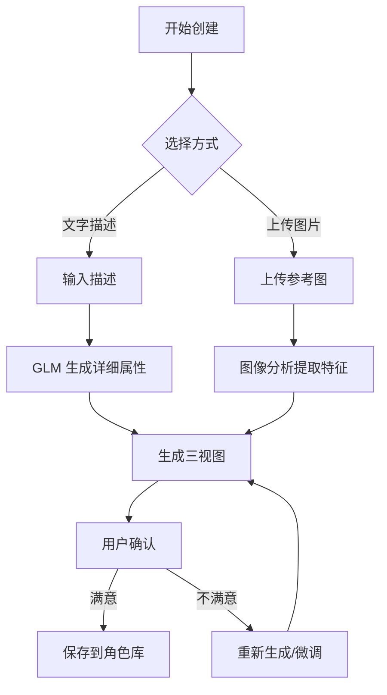
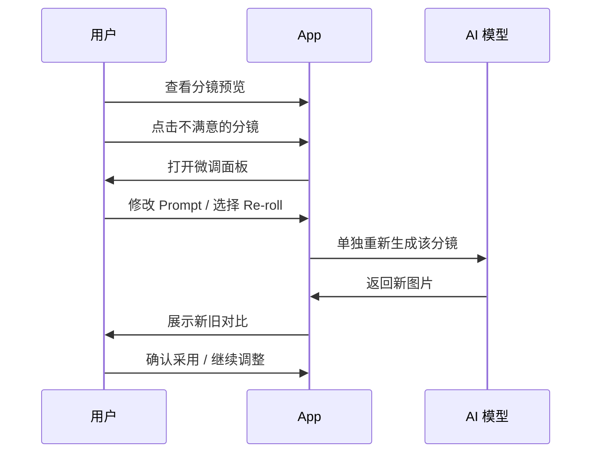

# 第三阶段需求文档：智慧 (The Brain)

> **周期**: 6 周  
> **目标**: 提升 AI 智能水平，实现角色一致性和导演模式  
> **前置条件**: 第一阶段基础设施完成

---

## 1. 阶段概述

第三阶段是技术深度最高的阶段，聚焦于 AI 表现力的核心突破。

| 任务编号 | 任务名称 | 优先级 | 预计周期 |
|----------|----------|--------|----------|
| #12 | 角色一致性系统 2.0 | P0 | 3 周 |
| #13 | 导演微调模式 | P0 | 2 周 |
| #14 | 统一模型接入层 | P1 | 1 周 |

---

## 2. 任务 #12: 角色一致性系统 2.0

**优先级**: P0  
**关联**: AI 表现力 2.1

### 2.1 现状分析

- 当前方案: 简单的 Prompt 描述 + 三视图 CharacterSheet
- 问题:
  - 跨场景角色差异明显
  - 用户需要多次重新生成
  - 无法固定特定画风

### 2.2 角色库系统

#### 2.2.1 功能描述

建立"演员表"机制，用户可以创建、管理、复用角色。

#### 2.2.2 数据模型

```dart
class Character {
  final String id;
  final String name;
  final String description;          // 角色描述
  final String? referenceImageUrl;   // 用户上传的参考图
  final CharacterSheet? sheet;       // 三视图
  final Map<String, String> attributes; // 属性: 年龄、性别、服装等
  final DateTime createdAt;
  final DateTime updatedAt;
}

class CharacterSheet {
  final String frontViewUrl;   // 正面
  final String sideViewUrl;    // 侧面
  final String backViewUrl;    // 背面
  final String combinedUrl;    // 组合图
  final String styleHash;      // 画风指纹
}
```

#### 2.2.3 角色库 UI

```
┌─────────────────────────────────────────┐
│  👥 我的角色库                            │
├─────────────────────────────────────────┤
│  ┌─────┐ ┌─────┐ ┌─────┐ ┌─────┐       │
│  │ 😊 │ │ 🐱 │ │ 🤖 │ │  +  │       │
│  │小明 │ │咪咪 │ │机器人│ │新建 │       │
│  └─────┘ └─────┘ └─────┘ └─────┘       │
│                                          │
│  ──────── 最近使用 ────────               │
│  • 小明 - 上次使用: 2天前                  │
│  • 咪咪 - 上次使用: 5天前                  │
└─────────────────────────────────────────┘
```

#### 2.2.4 角色创建流程



### 2.3 Seed 控制机制

#### 2.3.1 功能描述

固定随机种子以保持画风一致性。

#### 2.3.2 技术实现

```dart
class SeedController {
  /// 为项目生成固定种子
  int generateProjectSeed() {
    return DateTime.now().millisecondsSinceEpoch % 2147483647;
  }
  
  /// 基于角色生成派生种子
  int deriveCharacterSeed(int projectSeed, String characterId) {
    return (projectSeed + characterId.hashCode) % 2147483647;
  }
}

// 图片生成时注入 Seed
class ImageGenerationRequest {
  final String prompt;
  final String? referenceImage;
  final int? seed;  // 固定种子
  
  Map<String, dynamic> toJson() => {
    'prompt': prompt,
    'reference_image': referenceImage,
    'seed': seed,
  };
}
```

### 2.4 FaceID/LoRA 探索 (实验性)

#### 2.4.1 技术方案

| 方案 | 描述 | 可行性 |
|------|------|--------|
| InstantID | 人脸保持技术 | API 依赖 |
| IP-Adapter | 图像提示适配器 | ComfyUI 集成 |
| LoRA 训练 | 自定义模型 | 需要大量算力 |

#### 2.4.2 MVP 方案

优先使用 **IP-Adapter** 方案：

```dart
class IPAdapterRequest {
  final String prompt;
  final String faceImageUrl;      // 人脸参考
  final String styleImageUrl;     // 风格参考
  final double faceWeight;        // 人脸权重 0.0-1.0
  final double styleWeight;       // 风格权重 0.0-1.0
}
```

### 2.5 验收标准

- [ ] 角色库创建/编辑/删除功能完整
- [ ] 同一角色跨5个场景相似度 > 85%
- [ ] 用户"重新生成"次数下降 50%
- [ ] Seed 控制功能可用

---

## 3. 任务 #13: 导演微调模式

**优先级**: P0  
**关联**: AI 表现力 2.2

### 3.1 功能描述

引入"人机协作循环"，让用户像导演一样精细控制每个镜头。

### 3.2 分镜微调

#### 3.2.1 交互流程



#### 3.2.2 微调面板 UI

```
┌─────────────────────────────────────────┐
│  🎬 分镜 #3 微调                          │
├─────────────────────────────────────────┤
│  ┌─────────────┐  ┌─────────────┐       │
│  │   当前图     │  │   新生成    │       │
│  │   [图片]     │  │   [图片]    │       │
│  └─────────────┘  └─────────────┘       │
│                                          │
│  原始 Prompt:                             │
│  ┌─────────────────────────────────┐     │
│  │ A cute cat fighting in the...   │     │
│  └─────────────────────────────────┘     │
│                                          │
│  修改 Prompt:                             │
│  ┌─────────────────────────────────┐     │
│  │ A cute cat fighting, close-up   │     │
│  │ shot, dramatic lighting...      │     │
│  └─────────────────────────────────┘     │
│                                          │
│  [🔄 Re-roll] [✓ 采用新图] [✗ 保留原图]   │
└─────────────────────────────────────────┘
```

#### 3.2.3 实现代码

```dart
class SceneEditor {
  final ScreenplayController _controller;
  
  /// 重新生成单个场景
  Future<Scene> regenerateScene({
    required int sceneIndex,
    String? newPrompt,
    bool keepSeed = true,
  }) async {
    final scene = _controller.scenes[sceneIndex];
    
    final request = ImageGenerationRequest(
      prompt: newPrompt ?? scene.imagePrompt,
      referenceImage: scene.characterSheet?.combinedUrl,
      seed: keepSeed ? scene.seed : null,
    );
    
    final newImageUrl = await _controller.generateImage(request);
    
    return scene.copyWith(
      imageUrl: newImageUrl,
      imagePrompt: newPrompt ?? scene.imagePrompt,
    );
  }
}
```

### 3.3 运镜控制

#### 3.3.1 运镜类型

| 运镜 | 英文 | 效果描述 | Video Prompt 注入 |
|------|------|----------|-------------------|
| 推镜 | Push In | 镜头向前推进 | "camera slowly pushes forward" |
| 拉镜 | Pull Out | 镜头向后拉远 | "camera pulls back to reveal" |
| 横摇 | Pan | 镜头水平移动 | "camera pans from left to right" |
| 俯仰 | Tilt | 镜头垂直移动 | "camera tilts upward" |
| 环绕 | Orbit | 镜头绕主体转动 | "camera orbits around subject" |
| 跟拍 | Track | 镜头跟随主体 | "camera tracks the subject" |
| 静止 | Static | 镜头固定 | "static camera shot" |

#### 3.3.2 运镜选择 UI

```
┌─────────────────────────────────────────┐
│  🎥 运镜设置 - 场景 #3                    │
├─────────────────────────────────────────┤
│                                          │
│  [推镜]  [拉镜]  [横摇]  [俯仰]           │
│    ↓      ↑      ↔      ↕              │
│                                          │
│  [环绕]  [跟拍]  [静止]                  │
│    ○      →      ■                      │
│                                          │
│  预览效果:                                │
│  ┌─────────────────────────────────┐     │
│  │        [动画预览区]              │     │
│  └─────────────────────────────────┘     │
│                                          │
└─────────────────────────────────────────┘
```

#### 3.3.3 实现代码

```dart
enum CameraMotion {
  pushIn,
  pullOut,
  panLeft,
  panRight,
  tiltUp,
  tiltDown,
  orbit,
  track,
  static,
}

class CameraMotionInjector {
  static String injectMotion(String basePrompt, CameraMotion motion) {
    final motionPrompts = {
      CameraMotion.pushIn: 'camera slowly pushes forward, dolly in',
      CameraMotion.pullOut: 'camera pulls back to reveal the scene',
      CameraMotion.panLeft: 'smooth pan from right to left',
      CameraMotion.panRight: 'smooth pan from left to right',
      // ... 其他运镜
    };
    
    return '$basePrompt, ${motionPrompts[motion]}';
  }
}
```

### 3.4 验收标准

- [ ] 单场景重新生成功能完整
- [ ] Prompt 编辑 UI 可用
- [ ] 支持 7 种运镜类型选择
- [ ] 运镜效果符合预期

---

## 4. 任务 #14: 统一模型接入层

**优先级**: P1  
**关联**: 工程稳健性 1.4

### 4.1 功能描述

抽象出统一的模型接口，支持多厂商切换。

### 4.2 架构设计

```
┌─────────────────────────────────────────┐
│               应用层                     │
├─────────────────────────────────────────┤
│         Model Gateway (统一网关)         │
├─────────────────────────────────────────┤
│  ┌────────┐ ┌────────┐ ┌────────┐      │
│  │ Gemini │ │ 通义   │ │ SD/CF │       │
│  │Provider│ │Provider│ │Provider│       │
│  └────────┘ └────────┘ └────────┘      │
└─────────────────────────────────────────┘
```

### 4.3 接口定义

```dart
/// 图像生成器接口
abstract class ImageGenerator {
  String get providerName;
  
  Future<GenerationResult<String>> generate({
    required String prompt,
    String? referenceImage,
    int? seed,
    Map<String, dynamic>? options,
  });
  
  Future<bool> checkHealth();
}

/// 视频生成器接口
abstract class VideoGenerator {
  String get providerName;
  
  Future<GenerationResult<String>> generate({
    required String imageUrl,
    required String motionPrompt,
    int? seed,
    Map<String, dynamic>? options,
  });
  
  Future<bool> checkHealth();
}

/// 通用生成结果
class GenerationResult<T> {
  final T? data;
  final GenerationError? error;
  final Duration duration;
  final int retryCount;
  
  bool get isSuccess => error == null;
}
```

### 4.4 支持的提供商

| 类型 | 提供商 | 模型 | 状态 |
|------|--------|------|------|
| 图像 | Google Gemini | gemini-2.5-flash-image | 已集成 |
| 图像 | 阿里通义 | 通义万相 | 待接入 |
| 图像 | 字节 | 即梦 (Jimeng) | 待接入 |
| 图像 | 自建 | SD WebUI | 待接入 |
| 视频 | Google Veo | veo-3.1 | 已集成 |
| 视频 | 快手可灵 | Kling | 待接入 |

### 4.5 模型渠道管理 UI

```
┌─────────────────────────────────────────┐
│  ⚙️ 模型配置                             │
├─────────────────────────────────────────┤
│  图像生成模型:                            │
│  ┌─────────────────────────────────┐     │
│  │ ● Gemini (推荐)                 │     │
│  │ ○ 通义万相                       │     │
│  │ ○ 自定义 API                    │     │
│  └─────────────────────────────────┘     │
│                                          │
│  自定义配置:                              │
│  Base URL:  [_____________________]     │
│  API Key:   [_____________________]     │
│  Model ID:  [_____________________]     │
│                                          │
│  [测试连接]  [保存配置]                   │
└─────────────────────────────────────────┘
```

### 4.6 回退策略

```dart
class ModelGateway {
  final List<ImageGenerator> _imageGenerators;
  
  Future<String> generateImage(ImageRequest request) async {
    for (final generator in _imageGenerators) {
      try {
        if (await generator.checkHealth()) {
          final result = await generator.generate(
            prompt: request.prompt,
            referenceImage: request.referenceImage,
          );
          if (result.isSuccess) {
            return result.data!;
          }
        }
      } catch (e) {
        // 记录错误，尝试下一个
        _logger.warning('${generator.providerName} failed: $e');
      }
    }
    throw AllProvidersFailedException();
  }
}
```

### 4.7 验收标准

- [ ] 接口抽象完成
- [ ] 至少支持 2 个图像生成提供商
- [ ] 模型配置 UI 可用
- [ ] 回退策略正常工作

---

## 5. 技术依赖

### 5.1 新增依赖

```yaml
dependencies:
  # 无新增外部依赖，主要是架构重构
```

### 5.2 API 对接

- 通义万相 API 文档研究
- 即梦 API 接入可行性评估
- SD WebUI API 规范

---

## 6. 里程碑与成功指标

| 任务 | 里程碑 | 成功指标 |
|------|--------|----------|
| 角色一致性 | 角色库上线 | 跨场景相似度 > 85% |
| 导演模式 | 微调功能上线 | 用户重新生成次数下降 50% |
| 模型接入层 | 多厂商支持 | 支持 2+ 图像提供商 |

**阶段总体成功指标**: 用户"重新生成"次数下降 50%

---

## 7. 验收清单

### 阶段完成标准

- [ ] 角色库 CRUD 功能完整
- [ ] 三视图生成质量提升
- [ ] Seed 控制功能可用
- [ ] 分镜微调功能完整
- [ ] 运镜选择 UI 完成
- [ ] 统一模型接口完成
- [ ] 至少接入 2 个图像提供商
- [ ] 模型配置 UI 完成
