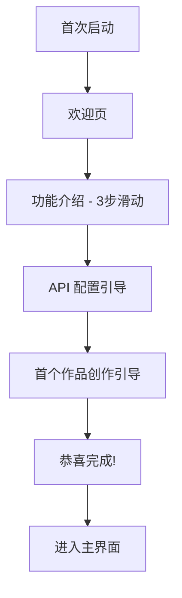

# 第四阶段需求文档：体验 (The Experience)

> **周期**: 4 周  
> **目标**: 优化用户体验，建立社交分享能力  
> **前置条件**: 核心功能稳定运行

---

## 1. 阶段概述

第四阶段聚焦于用户体验的打磨，让产品从"能用"进化到"好用"。

| 任务编号 | 任务名称 | 优先级 | 预计周期 |
|----------|----------|--------|----------|
| #15 | 创作流程优化 | P0 | 2 周 |
| #16 | 社交分享集成 | P1 | 1.5 周 |
| #17 | 国际化 (i18n) | P2 | 0.5 周 |

---

## 2. 任务 #15: 创作流程优化

**优先级**: P0  
**关联**: 用户体验 4.1

### 2.1 新手引导系统

#### 2.1.1 功能描述

首次使用时的分步引导，帮助用户快速上手。

#### 2.1.2 引导流程



#### 2.1.3 引导页面内容

| 页面 | 标题 | 描述 | 配图 |
|------|------|------|------|
| 1 | 输入创意 | 用一句话描述你的故事 | 输入框动画 |
| 2 | AI 创作 | AI 自动生成剧本和画面 | 生成过程动画 |
| 3 | 导出分享 | 一键导出精美视频 | 视频播放动画 |

#### 2.1.4 实现代码

```dart
class OnboardingService {
  static const String _onboardingKey = 'has_completed_onboarding';
  
  Future<bool> shouldShowOnboarding() async {
    final prefs = await SharedPreferences.getInstance();
    return !(prefs.getBool(_onboardingKey) ?? false);
  }
  
  Future<void> completeOnboarding() async {
    final prefs = await SharedPreferences.getInstance();
    await prefs.setBool(_onboardingKey, true);
  }
}

class OnboardingScreen extends StatefulWidget {
  @override
  _OnboardingScreenState createState() => _OnboardingScreenState();
}
```

### 2.2 创意模板库

#### 2.2.1 功能描述

预设热门创意模板，一键开始创作。

#### 2.2.2 模板分类

| 分类 | 模板示例 | 描述 |
|------|----------|------|
| 古风 | 仙侠传说 | 水墨画风，古风人物 |
| 校园 | 青春日记 | 日系画风，校园场景 |
| 科幻 | 星际冒险 | 赛博朋克，未来城市 |
| 童话 | 森林精灵 | 卡通风格，奇幻世界 |
| 都市 | 城市故事 | 现代风格，都市场景 |
| 搞笑 | 沙雕日常 | 夸张表情，搞笑剧情 |

#### 2.2.3 模板数据结构

```dart
class CreativeTemplate {
  final String id;
  final String name;
  final String category;
  final String description;
  final String thumbnailUrl;
  final String samplePrompt;        // 示例提示词
  final String styleDescription;    // 画风描述
  final List<String> tags;
  final int usageCount;             // 使用次数（热度）
}

class TemplateRepository {
  Future<List<CreativeTemplate>> getTemplates({
    String? category,
    String? searchQuery,
    SortBy sortBy = SortBy.popular,
  }) async {
    // 从本地资源或远程 API 获取模板
  }
  
  Future<void> applyTemplate(CreativeTemplate template) async {
    // 将模板应用到当前创作
  }
}
```

#### 2.2.4 模板库 UI

```
┌─────────────────────────────────────────┐
│  ✨ 创意模板                             │
├─────────────────────────────────────────┤
│  [全部] [古风] [校园] [科幻] [童话] ...  │
│                                          │
│  🔥 热门推荐                             │
│  ┌─────┐ ┌─────┐ ┌─────┐ ┌─────┐       │
│  │ 🏔️ │ │ 🏫 │ │ 🚀 │ │ 🧚 │       │
│  │仙侠 │ │青春 │ │星际 │ │精灵 │       │
│  │传说 │ │日记 │ │冒险 │ │童话 │       │
│  └─────┘ └─────┘ └─────┘ └─────┘       │
│                                          │
│  📝 最近使用                             │
│  • 仙侠传说 - 2天前                      │
└─────────────────────────────────────────┘
```

### 2.3 创意启发器

#### 2.3.1 功能描述

随机生成创意提示词，解决"不知道拍什么"的问题。

#### 2.3.2 实现方案

```dart
class CreativeInspiration {
  final List<String> characters = ['小猫', '机器人', '公主', '侦探', '外星人'];
  final List<String> actions = ['探险', '比赛', '相遇', '战斗', '旅行'];
  final List<String> places = ['森林', '城市', '太空', '海底', '古堡'];
  final List<String> emotions = ['搞笑', '感人', '惊险', '温馨', '神秘'];
  
  String generateInspiration() {
    final char = characters[Random().nextInt(characters.length)];
    final action = actions[Random().nextInt(actions.length)];
    final place = places[Random().nextInt(places.length)];
    final emotion = emotions[Random().nextInt(emotions.length)];
    
    return '一只$char在$place$action的$emotion故事';
  }
}
```

#### 2.3.3 启发器 UI

```
┌─────────────────────────────────────────┐
│  💡 创意启发                             │
├─────────────────────────────────────────┤
│                                          │
│    "一只小猫在太空探险的搞笑故事"          │
│                                          │
│           [🎲 换一个]                     │
│                                          │
│    [使用这个创意]                         │
└─────────────────────────────────────────┘
```

### 2.4 验收标准

- [ ] 新手引导流程完整
- [ ] 模板库至少 20 个模板
- [ ] 创意启发器可用
- [ ] 首次用户完成率 > 80%

---

## 3. 任务 #16: 社交分享集成

**优先级**: P1  
**关联**: 用户体验 4.2

### 3.1 分享渠道

| 渠道 | SDK | 优先级 | 备注 |
|------|-----|--------|------|
| 微信好友 | Fluwx | P0 | 需企业资质 |
| 微信朋友圈 | Fluwx | P0 | 需企业资质 |
| 抖音 | 抖音开放平台 | P1 | 需申请 |
| 系统分享 | share_plus | P0 | 通用方案 |

### 3.2 分享内容类型

| 类型 | 描述 | 适用场景 |
|------|------|----------|
| 视频分享 | 完整视频文件 | 抖音、朋友圈 |
| 链接分享 | 作品详情页链接 | 需要云端服务 |
| 图片分享 | 封面图 + 二维码 | 通用 |
| GIF 分享 | 短预览动图 | 微信群 |

### 3.3 分享组件

#### 3.3.1 UI 设计

```
┌─────────────────────────────────────────┐
│  📤 分享作品                             │
├─────────────────────────────────────────┤
│                                          │
│  ┌─────┐ ┌─────┐ ┌─────┐ ┌─────┐       │
│  │ 💬 │ │ 📱 │ │ 🎵 │ │ ⋯ │       │
│  │微信 │ │朋友圈│ │抖音 │ │更多 │       │
│  └─────┘ └─────┘ └─────┘ └─────┘       │
│                                          │
│  ─── 或 ───                             │
│                                          │
│  [保存到相册]  [复制链接]                 │
└─────────────────────────────────────────┘
```

#### 3.3.2 实现代码

```dart
class ShareService {
  final Fluwx _fluwx = Fluwx();
  
  Future<void> shareToWechat(ShareContent content) async {
    if (await _fluwx.isWeChatInstalled) {
      final model = WeChatShareVideoModel(
        scene: WeChatScene.SESSION,
        videoUrl: content.videoUrl,
        title: content.title,
        description: content.description,
        thumbData: content.thumbnailBytes,
      );
      await _fluwx.share(model);
    } else {
      // 降级到系统分享
      await _shareViaSystem(content);
    }
  }
  
  Future<void> saveToGallery(String videoPath) async {
    await GallerySaver.saveVideo(videoPath);
    // 显示成功提示
  }
}
```

### 3.4 作品集云同步 (可选)

#### 3.4.1 功能描述

将用户作品同步到云端，支持跨设备访问。

#### 3.4.2 技术方案

- 存储: 阿里云 OSS / 腾讯云 COS
- 同步: 用户登录后自动同步
- 隐私: 作品默认私有，可选公开

```dart
class CloudSyncService {
  Future<void> uploadWork(Work work) async {
    // 上传视频到 OSS
    final videoUrl = await _ossClient.upload(work.videoPath);
    
    // 保存元数据到后端
    await _apiClient.saveWork(WorkMetadata(
      id: work.id,
      title: work.title,
      videoUrl: videoUrl,
      createdAt: work.createdAt,
    ));
  }
  
  Future<List<Work>> fetchWorks() async {
    // 获取用户所有作品
  }
}
```

### 3.5 验收标准

- [ ] 微信分享功能可用
- [ ] 系统分享功能可用
- [ ] 保存到相册功能可用
- [ ] 分享率 > 10%

---

## 4. 任务 #17: 国际化 (i18n)

**优先级**: P2  
**关联**: 工程稳健性 1.8

### 4.1 功能描述

支持中/英双语界面切换。

### 4.2 技术方案

使用 Flutter 官方国际化方案: `flutter_localizations` + ARB 文件

#### 4.2.1 目录结构

```
lib/
└── l10n/
    ├── app_zh.arb    # 中文
    └── app_en.arb    # 英文
```

#### 4.2.2 ARB 文件示例

```json
// app_zh.arb
{
  "@@locale": "zh",
  "appTitle": "AI漫导",
  "createNew": "创建新作品",
  "inputPrompt": "描述你的创意...",
  "generating": "正在生成中...",
  "share": "分享",
  "save": "保存"
}

// app_en.arb
{
  "@@locale": "en",
  "appTitle": "DirectorAI",
  "createNew": "Create New",
  "inputPrompt": "Describe your idea...",
  "generating": "Generating...",
  "share": "Share",
  "save": "Save"
}
```

#### 4.2.3 配置文件

```yaml
# l10n.yaml
arb-dir: lib/l10n
template-arb-file: app_zh.arb
output-localization-file: app_localizations.dart
```

#### 4.2.4 使用方式

```dart
class MyApp extends StatelessWidget {
  @override
  Widget build(BuildContext context) {
    return MaterialApp(
      localizationsDelegates: AppLocalizations.localizationsDelegates,
      supportedLocales: AppLocalizations.supportedLocales,
      // ...
    );
  }
}

// 在组件中使用
Text(AppLocalizations.of(context)!.appTitle)
```

### 4.3 翻译范围

| 模块 | 条目数 | 优先级 |
|------|--------|--------|
| 导航/按钮 | ~30 | P0 |
| 提示信息 | ~50 | P0 |
| 错误信息 | ~20 | P1 |
| 帮助文档 | ~100 | P2 |

### 4.4 验收标准

- [ ] 中/英双语切换可用
- [ ] UI 无文案截断
- [ ] 日期/数字格式本地化

---

## 5. 技术依赖

### 5.1 新增依赖

```yaml
dependencies:
  # 国际化
  flutter_localizations:
    sdk: flutter
  intl: ^0.18.1
  
  # 分享
  fluwx: ^4.5.0          # 微信分享
  share_plus: ^7.2.1     # 系统分享
  gallery_saver: ^2.3.2  # 保存到相册
  
  # 新手引导
  introduction_screen: ^3.1.12
```

---

## 6. 里程碑与成功指标

| 任务 | 里程碑 | 成功指标 |
|------|--------|----------|
| 创作流程优化 | 新手引导上线 | 首次用户完成率 > 80% |
| 社交分享 | 分享功能上线 | 分享率 > 10% |
| 国际化 | 双语版本发布 | 海外用户占比 > 5% |

**阶段总体成功指标**: 分享率 > 10%

---

## 7. 验收清单

### 阶段完成标准

- [ ] 新手引导流程完整
- [ ] 模板库功能可用
- [ ] 创意启发器可用
- [ ] 微信分享功能可用
- [ ] 系统分享功能可用
- [ ] 保存到相册功能可用
- [ ] 中英双语切换可用
